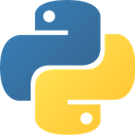

# py

*Distributed Python for the Erlang Ecosystem*




## Table of Contents

* [Introduction](#introduction-)
* [Requirements](#requirements-)
* [Setup](#setup-)
* [API Usage](#api-usage-)
  * [Metadata](#metadata-)
  * [Module Level](#module-level-)
    * [Calling Functions](#calling-functions-)
    * [Module Constants](#module-constants-)
  * [Objects](#objects-)
    * [Instantiation](#instantiation-)
    * [Calling Methods](#calling-methods-)
    * [Attribute Values](#attribute-values-)
    * [Operations on Objects](#operations-on-objects-)
  * [Experimental Dotted Name Support](#experimental-dotted-name-support-)
  * [ErlPort Pass-Through](#erlport-pass-through-)
  * [Builtins](#builtins-)
  * [Operators](#operators-)
  * [Non-Python Additions](#non-python-additions-)
  * [Missing Functions](#missing-functions-)
  * [Erlang](#erlang-)
* [Architecture](#architecture-)
  * [Overview](#overview-)
  * [Erlang Components](#erlang-components-)
  * [Python Components](#python-components-)
* [Controlling the Python Servers](#controlling-the-python-servers-)
  * Erlang Configuration
  * Python Configuration
  * Start, Stop, and Restart
  * Dynamically Adding More Python Servers
  * Automatic Restarts
  * Python Server Schedulers
* [Executing Code in Parallel](#executing-code-in-parallel-)
  * Identical Calls
  * Scatter/Gather
* [Distributed Python](#distributed-python-)
  * Starting Remote Python Servers
  * Executing Python on Remote Servers

## Introduction [&#x219F;](#table-of-contents)

This project provides two key features:

1. An easier interface to Python, wrapping
   [ErlPort](http://erlport.org/docs/python.html) calls. This lets you do the
   following very easily:
    * Make module-level calls
    * Get module-level constants
    * Instantiate objects
    * Call object methods
    * Get object attributes
    * Call builtins and operators with convenient wrappers
1. A means of running Python in a simple distributed context using all the
   well-known strengths of Erlang (fault-tolerance, scalability,
   concurrency, soft real-time, etc.).

What LFE py is not:

* A PaaS; if that's what you're interested in, please take a look at
  [CloudI](http://cloudi.org/).
* A framework for pipelining jobs across distributed data (e.g., mapreduce).
  For that, see the [Disco project](http://discoproject.org/).
* A language-agnostic, general-purpose ports server. LFE py is, in fact,
  built on one of those: [ErlPort](http://erlport.org/)!

LFE py was originally part of the
[lsci project](https://github.com/lfex/lsci), but was split out due to the
ErlPort/Python-wrapping code being generally useful for all sorts of projects,
not just scientific computing in Erlang/LFE.
This bit of background should give further insight
into the use cases LFE py was intended to address: scientific and (more
recently) general computing in Python from the Erlang VM, with a focus on
interactive workflows common in academic, research, and startup R&D
environments. Just the sort of thing that
[IPython](http://ipython.org/) excels at, minus the GUIs :-)


## Requirements [&#x219F;](#table-of-contents)

To use py, you need the following:

* [lfetool](http://docs.lfe.io/quick-start/1.html) and [rebar](https://github.com/rebar/rebar)
  (used by ``make`` targets to automatically set ``ERL_LIBS`` for deps)
* [Python 3](https://www.python.org/downloads/)
* ``wget`` (used to download ``get-pip.py``)


## Setup [&#x219F;](#table-of-contents)

For now, just run it from a git clone:

```bash
$ git clone git@github.com:lfex/py.git
$ cd py
$ make
```

Activate the Python virtualenv that was created by the ``make`` command you
just ran. Then start up the LFE REPL:

```bash
$ . ./python/.venv/bin/activate
$ make repl-no-deps
```

Note that the ``repl`` and ``repl-no-deps`` make targets automatically start up
the py (and thus ErlPort) Erlang Python server. If you run the REPL without
these ``make`` targets, you'll need to manually start things:

```bash
$ lfetool repl lfe -s py
```


## API Usage [&#x219F;](#table-of-contents)

Below we show some basic usage of py from both LFE and Erlang. In a
separate section a list of docs are linked showing detailed usage of wrapped
libraries.


### Metadata [&#x219F;](#table-of-contents)

First things first: let's make sure that you have the appropriate versions
of things -- in particular, let's confirm that you're running Python 3:

```cl
> (py-util:get-versions)
(#(erlang "17")
 #(emulator "6.2")
 #(driver-version "3.1")
 #(lfe "0.9.0")
 #(erlport "0.9.8")
 #(py "0.0.1")
 #(python
   ("3.4.2 (v3.4.2:ab2c023a9432, Oct  5 2014, 20:42:22)"
    "[GCC 4.2.1 (Apple Inc. build 5666) (dot 3)]")))
```


### Module Level [&#x219F;](#table-of-contents)

The following sub-sections describe module-level operations.


#### Calling Functions [&#x219F;](#table-of-contents)

```cl
> (py:func 'os 'getcwd)
"/Users/yourname/lab/erlang/py"
> (py:func 'datetime.datetime 'now)
#("datetime" #(2014 12 23 16 57 11 693773 undefined))
```

Note that strings in arguments need to be converted to binary:

```cl
> (py:func 'os.path 'isfile '(#b("/tmp")))
false
> (py:func 'os.path 'isdir '(#b("/tmp")))
true
```

Keyword arguments are passed as proplists, e.g.,
``'(#(key1 val1) #(key2 val2))``. In the next example we'll pass a string (as
a binary) which represents a binary number. We'll give ``int`` the keyword of
``base``, since we're not going to use the default decimal base (10):

```cl
(py:func 'builtins 'int '(#b("101010")) '(#(base 2)))
42
```


#### Module Constants [&#x219F;](#table-of-contents)

```cl
> (py:const 'math 'pi)
3.141592653589793
```

Optionally, you may provide a type:

```cl
> (py:const 'math 'pi 'float)
3.141592653589793
> (py:const 'math 'pi 'int)
3
> (py:const 'math 'pi 'str)
"3.141592653589793"
```


### Objects [&#x219F;](#table-of-contents)

The following sections describe how to work with Python objects.


#### Instantiation [&#x219F;](#table-of-contents)

With no arguments passed to the constructor:

```cl
> (py:init 'builtins 'dict)
#("dict" ())
> (py:init 'collections 'UserDict)
#("UserDict" ())
```

With args:

```cl
> (py:init 'datetime 'date '(1923 4 2))
#("date" #(1923 4 1))
```


#### Calling Methods [&#x219F;](#table-of-contents)

To call a method, we need an object. Let's return to the date example
above:

```cl
> (set now (py:func 'datetime.datetime 'now))
#("datetime" #(2014 12 23 23 14 37 677463 undefined))
```

The tuple representing a date time object has been saved as the ``now``
variable in the REPL. Let's call some methods:

```cl
> (py:method now 'strftime '(#b("%Y.%m.%d %H:%M:%S")))
"2014.12.23 23:14:37"
```

#### Attribute Values [&#x219F;](#table-of-contents)

Continuing with that same object:

```cl
> (py:attr now 'year)
2014
> (py:attr now 'microsecond)
677463
```


#### Operations on Objects [&#x219F;](#table-of-contents)

Let's get another time ... and give our other variable a better name:

```cl
> (set later (py:func 'datetime.datetime 'now))
#("datetime" #(2014 12 23 23 21 25 714474 undefined))
> (set earlier now)
#("datetime" #(2014 12 23 23 14 37 677463 undefined))
```

Let's use the two objects in a calculation:

```cl
> (set diff (py:sub later earlier))
#("timedelta" 0 408 37011)
> (py:attr diff 'seconds)
408
```

We can get that in minutes in LFE/Erlang:

```cl
> (/ (py:attr diff 'seconds) 60)
6.8
```


### Experimental Dotted Name Support [&#x219F;](#table-of-contents)

There is currently tentative support for dotted names in the following
calls:

 * ``(py:const ...)``
 * ``(py:func ...)``
 * ``(py:init ...)``

Examples:

```cl
> (py:const 'math.pi)
3.141592653589793
```

```cl
> (py:func 'datetime.datetime.now)
#("datetime" #(2014 12 29 0 47 30 334180 undefined))
> (py:func 'math.pow '(2 16))
65536.0
> (py:func 'builtins.int '(#b("101010")) '(#(base 2)))
42
```

```cl
> (py:init 'collections.UserDict)
#("UserDict" ())
> (py:init 'collections.UserDict '() '(#("a" 1) #("b" 2)))
#("UserDict" (#("b" 2) #("a" 1)))
```

Though this is offered, it isn't really encouraged, since there will
necessarily be inconsistencies in usage. Dotted notation can be used with
``const``, ``func``, and ``init`` but not with objects (i.e., not with
``method`` and ``attr``). This mixing of styles could get confusing and
you may think you have a bug in your code when, in fact, you just can't use
dotted names with instantiated objects (since in LFE it's just a variable
name, not an actual object).

Finally, with this code in place, many more function calls are incurred
regardless of whether dotted notation is used. For this reason and the
discouragement against use above, this feature is on the short list for
getting axed. Don't count on it being around ...


### ErlPort Pass-Through [&#x219F;](#table-of-contents)

If for any reason you would like to skip the LFE py wrappers and call directly
to ErlPort, you may do so:

```cl
> (py:pycall 'datetime 'datetime.now)
("datetime" #(2014 12 25 20 44 4 673150 undefined))
> (py:pycall 'datetime 'datetime '(1923 4 2 0 0 0))
#("datetime" #(1923 4 2 0 0 0 0 undefined))
```

These make direct calls to ErlPort's ``python:call`` function, but supply the
required Python server ``pid`` behind the scenes.


### Builtins [&#x219F;](#table-of-contents)

In several of the examples above, we made calls to the ``builtins`` module
like so:

```cl
> (py:init 'builtins 'dict)
#("dict" ())
> (py:func 'builtins 'int '(#b("101010")) '(#(base 2)))
42
```

LFE py actually provides wrappers for these, making such calls much easier.

```cl
> (py:dict)
#("dict" ())
> (py:dict '(#("a" 1) #("b" 2)))
#("dict" (#("b" 2) #("a" 1)))
> (py:int #b("101010") '(#(base 2)))
42
```

More examples:

```cl
> (py:any '(true true false false false true))
true
> (py:all '(true true false false false true))
false
> (py:all '(true true true))
true
> (py:pow 6 42)
481229803398374426442198455156736
> (py:round 0.666666667 5)
0.66667
> (py:range 7 42)
#($erlport.opaque python
  #B(128 2 99 95 95 98 117 105 108 ...))
> (py:len (py:range 7 42))
35
> (py:pylist (py:range 7 42))
(7 8 9 10 11 12 13 14 15 16 17 18 19 20 21 22 23 24 25 26 27 28 29 30
 31 32 33 34 35 36 ...)
> (erlang:length (py:pylist (py:range 7 42)))
35
```


### Operators [&#x219F;](#table-of-contents)

It will often be the case that you want to operate on the Python data
structures obtained via the LFE py calls directly in Python, without
translating them into LFE/Erlang. The Python ``operator`` module is wrapped
for your convenience in these cases.

Examples:

```cl
> (py:add 37 5)
42
> (py:mul 7 6)
42
> (py:sub -108 -150)
42
> (py:truediv 462 11)
42.0
> (py:floordiv 462 11)
42
```

Equality:

```cl
> (py:gt 7 6)
true
> (py:le 7 6)
false
> (py:eq 42 42)
true
```

Bitwise operations:

```cl
> (py:and- 60 13)
12
> (py:or- 60 13)
61
> (py:xor 60 13)
49
> (py:inv 60)
-61
> (py:rshift 60 2)
15
> (py:lshift 60 2)
240
```


#### Non-Python Additions [&#x219F;](#table-of-contents)

So as not to stomp on the LFE function ``(list ...)``, the Python ``list``
builtin has been aliased to the ``pylist`` function, e.g.:

```cl
> (py:pylist)
()
> (py:pylist '(1 2 3 4))
(1 2 3 4)
```

``(py:dir ...)`` and ``(py:vars ...)`` return elided lists, so you won't see
complete results that are longer than 28 elements. If you wish to see
everything, you may call ``(py:pdir)`` and ``(py:pvars)``, respectively.

``(py:repr)`` provides wrapping for the Python builtin ``repr``. If you would
like to see a representation of the pickled Python data in LFE, you may use
the ``(py:prepr)`` function.


### Missing Functions [&#x219F;](#table-of-contents)

Any Python function that does in-place modification of objects is not included.
LFE py will eventually provide analogs for in-place functions that return a new
data set or object.


### Erlang [&#x219F;](#table-of-contents)

We can, of course, do all of this from Erlang:

```bash
$ make shell-no-deps
```

```erlang
1> 'py-util':'get-versions'().
[{erlang,"17"},
 {emulator,"6.2"},
 {'driver-version',"3.1"},
 {lfe,"0.9.0"},
 {'lfe-py',"0.0.1"},
 {python,["3.4.2 (v3.4.2:ab2c023a9432, Oct  5 2014, 20:42:22)",
          "[GCC 4.2.1 (Apple Inc. build 5666) (dot 3)]"]}]
2> py:func(os, getcwd).
"/Users/oubiwann/Dropbox/lab/erlang/py"
3> py:func('datetime.datetime', now).
{"datetime",{2014,12,25,23,16,14,979696,undefined}}
4> py:func('os.path', isfile, [<<"/tmp">>]).
false
5> py:func('os.path', isdir, [<<"/tmp">>]).
true
6> py:func(builtins, int, [<<"101010">>], [{base, 2}]).
42
7> py:const(math, pi).
3.141592653589793
8> py:const(math, pi, float).
3.141592653589793
9> py:const(math, pi, int).
3
10> py:const(math, pi, str).
"3.141592653589793"
11> py:init(builtins, dict).
{"dict",[]}
12> py:init(collections, 'UserDict').
{"UserDict",[]}
13> py:init(datetime, date, [1923, 4, 2]).
{"date",{1923,4,2}}
```

```erlang
14> Now = py:func('datetime.datetime', now).
{"datetime",{2014,12,25,23,16,57,146812,undefined}}
15> py:method(Now, strftime, [<<"%Y.%m.d %H:%M:%S">>]).
"2014.12.d 23:16:57"
16> py:attr(Now, year).
2014
17> py:attr(Now, microsecond).
146812
```

```erlang
18> Later = py:func('datetime.datetime', now).
{"datetime",{2014,12,25,23,19,51,934212,undefined}}
19> Earlier = Now.
{"datetime",{2014,12,25,23,16,57,146812,undefined}}
20> Diff = py:sub(Later, Earlier).
{"timedelta",{0,174,787400}}
21> py:attr(Diff, seconds).
174
22> py:attr(Diff, seconds) / 60.
2.9
```

```erlang
23> py:pycall(datetime, 'datetime.now').
{"datetime",{2014,12,25,23,24,46,525495,undefined}}
24> py:pycall(datetime, datetime, [1923, 4, 2, 0, 0, 0]).
{"datetime",{1923,4,2,0,0,0,0,undefined}}
```

```erlang
25> py:dict().
{"dict",[]}
26> py:dict([{"a", 1}, {"b", 2}]).
{"dict",[{"b",2},{"a",1}]}
27> py:int(<<"101010">>, [{base, 2}]).
42
28> py:any([true, true, false, false, false, true]).
true
29> py:all([true, true, false, false, false, true]).
false
30> py:all([true, true, true]).
true
31> py:pow(6, 42).
481229803398374426442198455156736
32> py:round(0.666666667, 5).
0.66667
33> py:range(7, 42).
{'$erlport.opaque',python,
                   <<128,2,99,95,95,98,117,105,108,...>>}
34> py:len(py:range(7, 42)).
35
35> py:pylist(py:range(7, 42)).
[7,8,9,10,11,12,13,14,15,16,17,18,19,20,21,22,23,24,25,26,
 27,28,29,30,31,32,33,34,35|...]
36> length(py:pylist(py:range(7, 42))).
35
```

```erlang
37> py:add(37, 5).
42
38> py:mul(7, 6).
42
39> py:sub(-108, -150).
42
40> py:truediv(462, 11).
42.0
41> py:floordiv(462, 11).
42
42> py:gt(7, 6).
true
43> py:le(7, 6).
false
44> py:eq(42, 42).
true
45> py:'and-'(60, 13).
12
46> py:'or-'(60, 13).
61
47> py:'xor'(60, 13).
49
48> py:inv(60).
-61
49> py:rshift(60, 2).
15
50> py:lshift(60, 2).
240
```

```erlang
51> py:pylist().
[]
52> py:pylist([1, 2, 3, 4]).
[1,2,3,4]
```


## Architecture [&#x219F;](#table-of-contents)


### Overview [&#x219F;](#table-of-contents)

Here is a high-level diagram of the LFE py architecture:

```
+-------------------------------------------+
|                                           |
| +-----------+ +-----------+ +-----------+ |
| | py Worker | | py Worker | | py Worker | |
| +------+----+ +-----+-----+ +-----+-----+ |
|        |            |             |       |
|        |            |             |       |
|        |       +----+---+         |       |
|        |       |        |         |       |
|        +-------+ py+sup +---------+       |
|                |        |                 |
|                +----+---+                 |
|                     |                     |
|                +----+---+                 |
|                |        |                 |
|                | py+app |                 |
|                |        |                 |
|                +--------+                 |
|                                           |
|                  LFE py                   |
+---------------------+---------------------+
|        LFE          |       ErlPort       |
+---------------------+---------------------+
|                 Erlang/OTP                |
+-------------------------------------------+
```

Each py Worker is actually a wrapper for an ErlPort ``gen_server`` which starts
up Python interpreter. LFE py is only designed to work with Python 3. Both
ErlPort and it provide Python 3 modules for use in the interpreters started
by the workers. They have the following conceptual structure:

```
+----------------+
|                |
|  +----------+  |
|  | Encoders |  |
|  +----------+  |
|  +----------+  |
|  | Decoders |  |
|  +----------+  |
|                |
|   LFE py lib   |
+----------------+
|   ErlPort lib  |
+----------------+
|    Python 3    |
+----------------+
```

As depicted above, when the LFE py/ErlPort Python server starts, it brings up
a Python 3 interpreter. LFE py configures the ``PYTHONPATH`` for
ErlPort so that the custom encoder, decoder, and object helper Python modules
are available for use by all Python calls issued to the workers.


### Erlang Components [&#x219F;](#table-of-contents)

Working our way up from the diagram, here are references for Erlang/OTP
components of LFE py:

* [Erlang/OTP](http://learnyousomeerlang.com/what-is-otp)
* [Erlang/OTP apps](http://learnyousomeerlang.com/building-applications-with-otp)
* [How ErlPort works](http://erlport.org/docs/#id3)
* [LFE](http://en.wikipedia.org/wiki/LFE_%28programming_language%29)
* [py-app](https://github.com/lfex/py/blob/master/src/py-app.lfe)
* [py-app](https://github.com/lfex/py/blob/master/src/py-sup.lfe)
* [py Workers](https://github.com/lfex/py/blob/master/src/py.lfe#L7)


### Python Components [&#x219F;](#table-of-contents)

And here are references for the Python components in LFE py:

* [Python 3](https://docs.python.org/3/)
* [ErlPort Python library](https://github.com/hdima/erlport/tree/master/priv/python3/erlport)
* [LFE py Python library](https://github.com/lfex/py/tree/master/python/lfe)
* [py Encoders](https://github.com/lfex/py/blob/master/python/lfe/encoders.py)
* [py Decoders](https://github.com/lfex/py/blob/master/python/lfe/decoders.py)


## Controlling the Python Servers [&#x219F;](#table-of-contents)

### Erlang Configuration [&#x219F;](#table-of-contents)

### Python Configuration [&#x219F;](#table-of-contents)

### Start, Stop, and Restart [&#x219F;](#table-of-contents)

### Dynamically Adding More Python Servers [&#x219F;](#table-of-contents)

### Automatic Restarts [&#x219F;](#table-of-contents)

### Python Server Schedulers [&#x219F;](#table-of-contents)


## Executing Code in Parallel [&#x219F;](#table-of-contents)

### Identical Calls [&#x219F;](#table-of-contents)

### Scatter/Gather [&#x219F;](#table-of-contents)


## Distributed Python [&#x219F;](#table-of-contents)

### Starting Remote Python Servers [&#x219F;](#table-of-contents)

### Executing Python on Remote Servers [&#x219F;](#table-of-contents)
